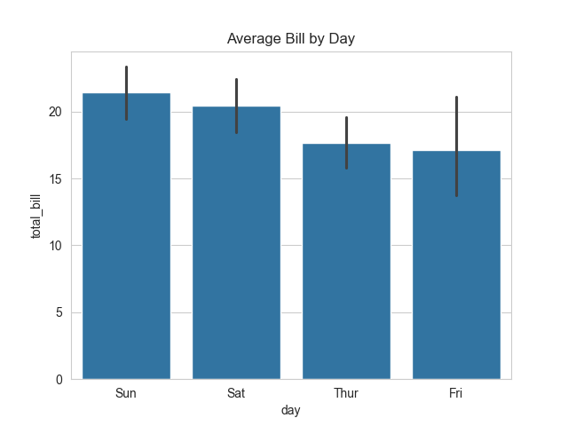
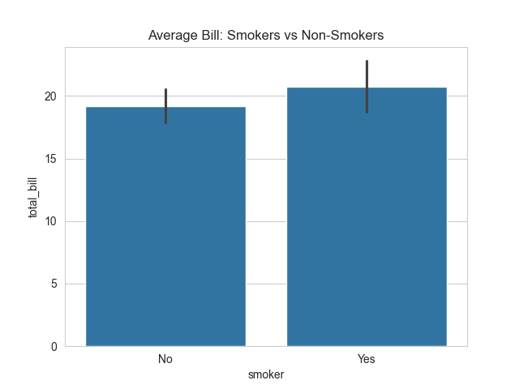
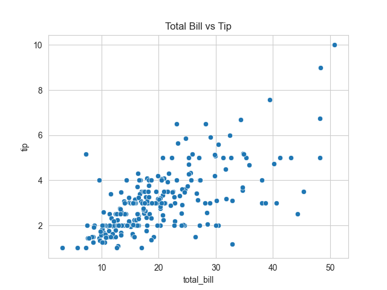
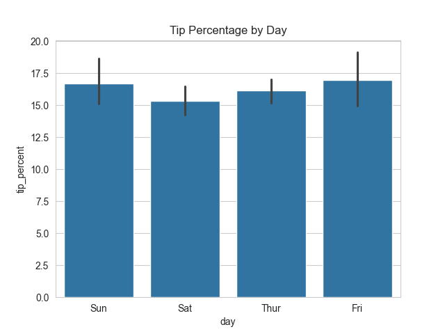
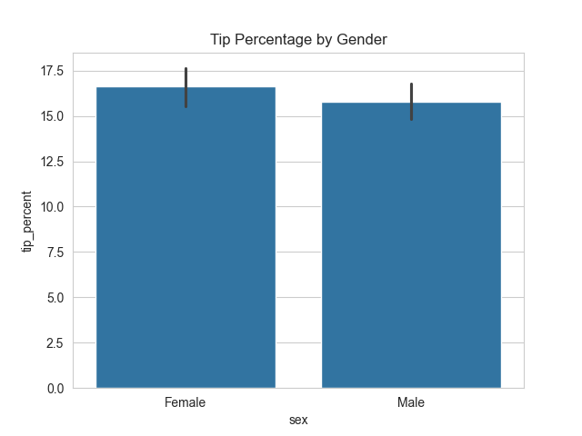

# Restaurant Tips Analysis

## Overview
This project analyzes restaurant tipping data using Python.

## Tools Used
- Python
- pandas
- matplotlib
- seaborn

## Analysis Performed
- Average bill analysis
- Comparison by day, smoker status, and gender
- Tip percentage calculation

## Key Insights
- Average bill is higher on weekends
- Smokers tend to spend slightly more
- Tips increase with total bill amount
- Tip percentage is lowest on Saturday
- Females tip a higher percentage than males

## Visualizations

### Average Bill by Day

### Smokers vs Non-Smokers

### Total Bill vs Tip

### Tip Percentage by Day

### Tip Percentage by Gender

